

  <h3 align="center">WORLD CAPITALS QUIZ</h3>
  

    INTERACTIVE PYTHON GAME
   
   
    <a href="https://guess-world-capital.herokuapp.com/">View Demo</a>
   
  

 

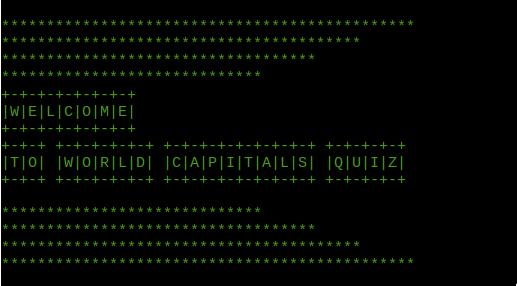

## About The Project

The project idea was inspired by geography classes and the ambitious goal to learn all 195 world capital cities. [learn more](https://www.thoughtco.com/capitals-of-every-independent-country-1434452#:~:text=195%20Capital%20Cities%20of%20the%20World)

The game goal is to recall as many world capital cities as possible. 
As the game creator, I wanted to build an easy to follow game, which is both enjoyable and educational. 

The key project goal is to produce a simple game that stimulates memory and assists in learning new world capitals. The target audience is anyone interested in refreshing their current geography knowledge.

  
 Click to view Table of Contents

  <ol>
    <li><a href="#built-with">Built With</a></li>
    <li><a href="#ux-and-ui">UX</a></li>
    <li><a href="#data-storage">Data Storage</a></li>
    <li><a href="#deployment">Deployment</a></li>
    <li><a href="#testing">Testing</a></li>
    <li><a href="#credits">Credits</a></li>
  </ol>

## Built With

The project was built using the following Python packages:

* [random](https://docs.python.org/3/library/random.html)
* [gspread](https://docs.gspread.org/en/latest/)
* [termcolor](https://pypi.org/project/termcolor/)
* [google.oauth2.service_accoun](https://google-auth.readthedocs.io/en/master/reference/google.oauth2.service_account.html)
* [emoji](https://pypi.org/project/emoji/)
* [time](https://docs.python.org/3/library/time.html)
* [pyfiglet](https://pypi.org/project/pyfiglet/0.7/)

## UX

**User Story**
    
1. To understand the purpose of the game.

2. To be able to start and exit the game as required.

3. To be able to see current and final scores.

 **Flowchart**

The game flow schema was created using Figma and shows the simple logic of the game. The user is required to confirm if the game is wished to be continued or not. If confirmation is positive, the game proceeds to ask what continent the user wants to pick, otherwise the game ends with a farewell message. After the user picks the continent, the code generates a random country and its capital city for the user  to guess. The clue with the first and last letters of the city is displayed after the question. The user is given three attempts to name the city. Incorrect and correct answers increment accordingly. The user is then offered to choose a continent again. If the user chooses to pick a continent, the game continues to the continent choice and the game code repeats the loop. If the user chooses not to continue to the continent choice, the game final score is displayed and the game ends.

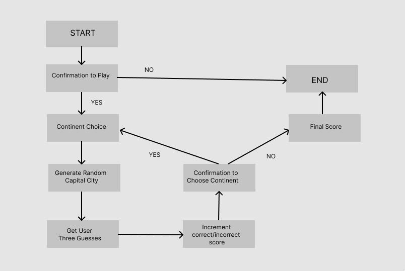

(<a href="#about-the-project">back to top</a>)

## Data Storage

Five Google sheets were created for each of the continents used in the game containing one column for country names and one for capital city names. These sheets are connected through Google Sheet and Google Drive APIs to run.py. This is done by two dependencies: google-auth and gspread which provide authentication and data access/manipulation. In order for Heroku to have the access to the spreadsheets, creds.json file contents has to be used. Therefore, the Config Vars are added on Heroku to accommodate the access. 

(<a href="#about-the-project">back to top</a>)

## Deployment

This project was developed using GitPod, pushed to GitHub, and  build as an app on Heroku:

1. In Heroku Settings tab click "Create new app", name the project and pick region.
2. In Reveal Config Vars enter PORT - 8000 as first entry, and 
CREDS -  contents of creds.json as the second entry.
3. In Buildpack install further dependencies Python as first, and NodeJS as second. 
4. In Heroku Deploy tab select Github as deployment method and click connect. Search for the repo name at Github and set up automatic deployment.

(<a href="#about-the-project">back to top</a>)

## Testing

**Linter Testing**

The game was tested using the PEP8online.com linter. No errors were returned for submitted run.py code. The result was achieved after clearing the following errors:
* E128  continuation line under-indented for visual indent
* E127  continuation line over-indented for visual indent
* E225	missing whitespace around operator
* E302	expected 2 blank lines, found 0

 
  
 ** Click to view PEP8 linter result ** 

  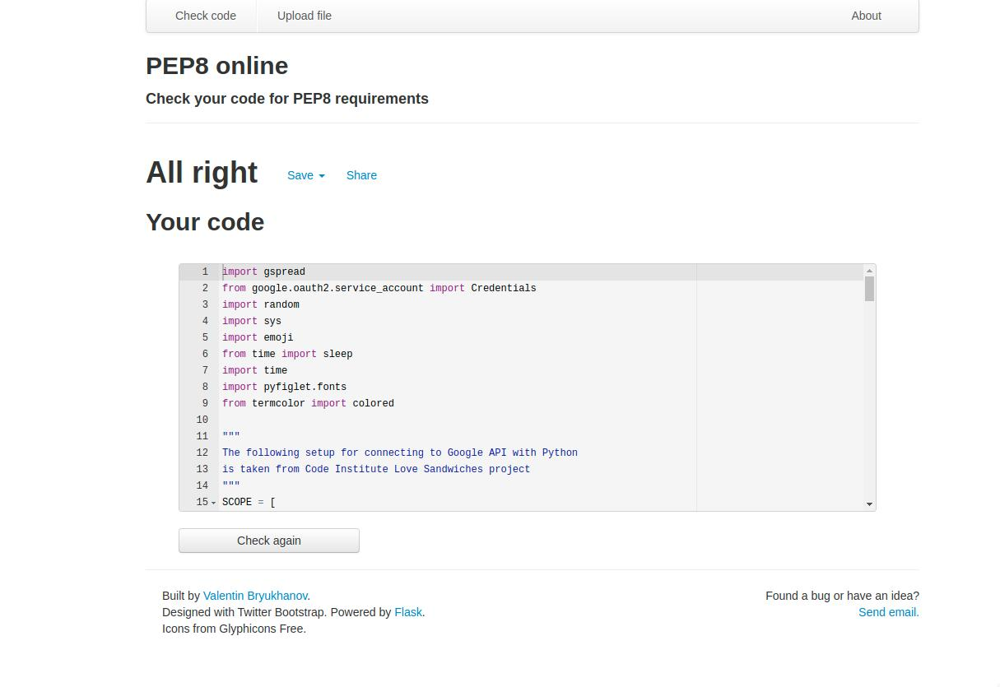

(<a href="#about-the-project">back to top</a>)

**Manual Testing**

The game was tested continuously during the coding to ensure the user inputs are validated and code renders according to the game logic.

* Introduction
    1. The welcome message appears in green color and using pyfiglet font.
    2. When user input is empty, the user is prompted to try again.
    3. Instructions are printed gradually.

 
  
 ** Click to view Introduction ** 

  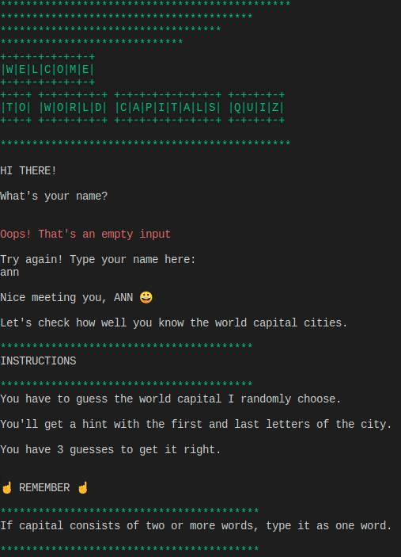

 * Confirmation to Continue
    1. The user is offered to continue the game or not.
    2. When user input is empty or not equal to 'yes'/'no', the user is prompted to check the input and try again.  
    3. When user input is 'no', the game terminates with a farewell message.

 
  
 ** Click to view Confirmation to Continue ** 

  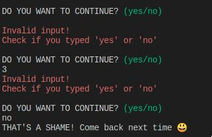

    
  * Continent Choice
    1. The user is prompted to choose a number corresponding to a particular continent.
    2. When user input is not a number from 1 to 5 inclusive, the user is notified about the invalid input and asked to try again.
    3. When user input is correct, the user choice is confirmed.
 
 
  
 ** Click to view Continent Choice ** 

  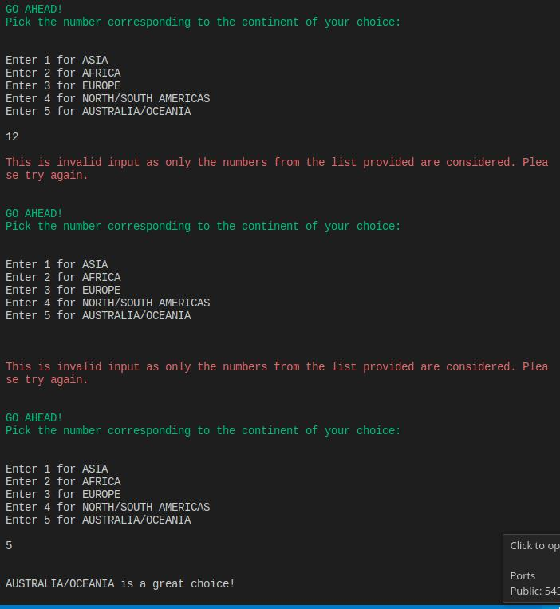

  * Loading Animation
    1. The loading animation function is called after the user chooses a continent and runs briefly.
 
 
  
 ** Click to view Loading Animation** 

  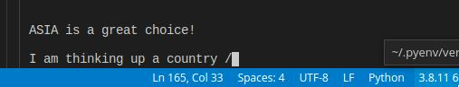

  * Play
    1. A random capital city is generated and a clue is given by providing the first and last letter of the city.
    2. The user is prompted to make three guesses.
    3. The right answer is revealed after three unsuccessful guesses.
    4. The updated score is displayed.
    5. The user is given a choice of picking a continent again and the input is validated.
    6. The game terminates after user chooses not to pick a continent. The final score and a farewell message are displayed.
 
 
  
 ** Click to view Play ** 

  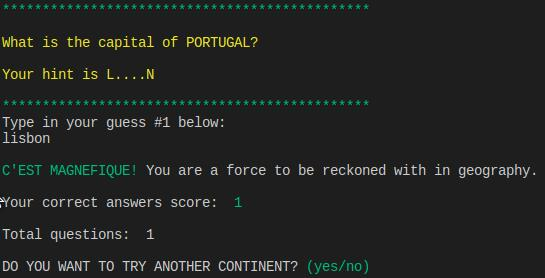
  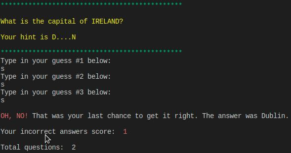
  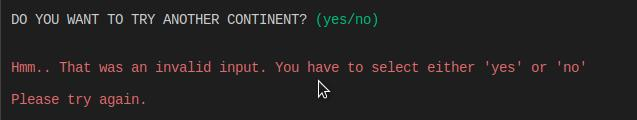
  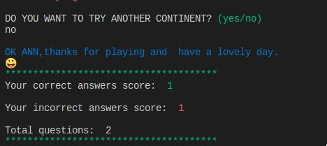

**Bugs**

* The correct/incorrect answers count did not increase in play() function and always added to 1 regardless of how many times continents were played. Solution was found by declaring correct and incorrect variables outside play().
* Heroku did not render pyfiglet and termcolor modules. The solution was found updating requirements.txt. by running  <code>pip3 freeze >requirements.txt</code>

(<a href="#about-the-project">back to top</a>)

## Credits

**Frameworks, Libraries, and Tools**

* GitHub - used for version control and hosting.
* Slack - used for support and advice from the Code Institute       Community.
* Heroku - used to deploy the live project.
* GitPod - used for automated dev environment
* PEP8 - used for Python code validation.
* Figma - used to generate flowchart image.

**Code/Content**

The following code by Ugo5738 and Youtube tutorial was used to assist my learning of game logic and coding solutions:

* [Countries and Capitals](https://github.com/Ugo5738/Countries-and-Capitals/blob/master/Countries%20and%20Capitals.py)
* [Project Based Python: Country Capitals](https://www.youtube.com/watch?v=yBkRLhoVTmc&list=WL&index=2)

**Acknowledgment**

 * My family and friends for continuous support
 * Code Institute team and community.

(<a href="#about-the-project">back to top</a>)

